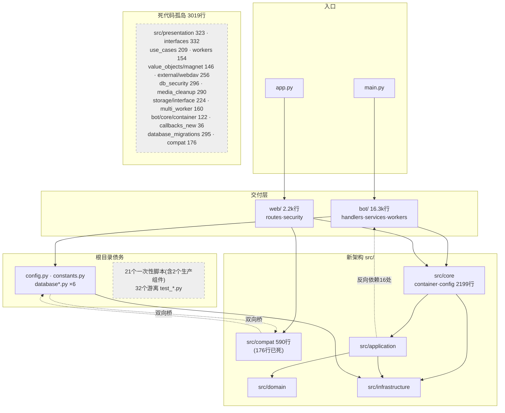

# Save-Restricted-Bot 架构与重构分析报告

- **分析日期**：2026-07-26
- **代码基线**：`feat/mobile-responsive-optimization-v2` @ `651ef17`（含 16 个未提交改动）
- **分析方法**：15 个并行代理覆盖 11 个维度 + 3 轮对抗性交叉验证 + 主线实测复核
- **验证强度**：258 条独立核验判定，212 条 CONFIRMED（82%）、45 条 PARTIAL（方向成立、数字或行号需微调）、1 条 REFUTED（已从报告删除）

**关于项目背景**：需求方模板中的项目定位、技术栈、痛点、团队规模等占位符均为空，以下内容由代码与运行态实证推断。标注「假设」处需确认。

**工具说明**：`archi` 全量 LLM 分析本次不可用（本地后端 `127.0.0.1:8317` 返回 503）。仓库内 `.architec/architec-summary.md` 是 2026-03-29 的陈旧快照，其核心结论已被代码演进推翻（见 §3 P2-1），本报告不采信。

---

## ⚠️ 报告前置：一项需要立即处理的运行态问题

这不是代码问题，静态分析发现不了——它需要看**正在运行的部署**。

**Web 管理后台当前在公网裸奔，且会话签名密钥是仓库里公开可见的字面量。**

| 事实 | 证据 |
|---|---|
| 本机是公网 VPS | `ip addr` → `eth0 inet 23.82.96.72/24 scope global` |
| 后台端口对全网监听 | `ss -tlnp` → `LISTEN 0.0.0.0:10000` |
| 防火墙放行 | `ufw status` → `10000/tcp ALLOW Anywhere`（v4 + v6） |
| 域名亦可达 | `/etc/nginx/sites-enabled/save-restricted-bot` 已启用，反代 `127.0.0.1:10000` |
| 服务在运行 | `docker ps` → `save-restricted-bot-web  Up 2 hours (healthy)  0.0.0.0:10000->10000/tcp` |
| **会话签名密钥为公开值** | `docker inspect` → `FLASK_SECRET_KEY=change-this-secret-key-in-production`（即 `docker-compose.yml:22` 的默认值，git 已跟踪） |
| **管理员口令为 admin/admin** | `docker inspect` → `ADMIN_PASSWORD=`（空）；`migrations.py:247` → `password = os.environ.get("ADMIN_PASSWORD") or "admin"` |

### 两条互相独立的完全接管路径

1. **伪造 session** —— 密钥任何读过本仓库的人都知道。`web/auth.py:23` 的 `login_required` 只检查 `'username' in session`，签名有效即通过。**不需要任何凭据。**
2. **admin/admin 直接登录** —— `web/routes/auth.py:42` 的 `must_change_password` 只是登录**成功之后**打的标记，不阻止登录。

后台背后是该 Telegram 账号的全部笔记、媒体文件与脚本配置。

### 建议立即执行（不要等重构排期）

```bash
ufw delete allow 10000/tcp
# docker-compose.yml 端口改为 127.0.0.1:10000:10000
# .env 补 FLASK_SECRET_KEY=$(openssl rand -hex 32) 与强 ADMIN_PASSWORD
docker compose up -d --force-recreate
```

分析过程中未尝试登录，也未尝试伪造 session，只读取了配置。

---

## 1. 执行摘要

### 1.1 项目定位

自托管的 Telegram「受限内容抓取 + 归档」机器人，配套 Flask Web 管理后台；集成 qBittorrent / WebDAV 做磁力链校准与媒体存储。单管理员、双进程（Bot + Web 两个独立容器共享 `./data` 卷）、SQLite 单机部署。

### 1.2 整体健康度：5 / 10

不是单一分数能概括的项目，分面看：

| 面向 | 评分 | 实测依据 |
|---|---|---|
| **代码工艺** | 7 | 运行时文件 >300 行仅 **3 个**；函数 >50 行仅 26 个且 Top15 几乎全在根目录一次性脚本；类型注解率 **88.2%**（`src/` 95.3%） |
| **Web 应用层安全** | 7 | 27 个端点 23 个受保护、4 个合理公开；CSRF、安全响应头、bcrypt、登录后 `session.clear()`；路径穿越有 `commonpath` 校验且有测试；SQL 全量参数化 |
| **测试** | 4 | 289 项单测 9.18 秒全通过是真资产；但覆盖率 45.8% 且被死代码 re-export 抬高，`web/routes` 成片 0%，60% 测试资产在 CI 之外 |
| **结构** | 3 | 4 套并行结构固化；775 条 import 边坍缩成一个 **16 包强连通分量**；`src/`→`bot/` 反向依赖 16 处；**3,019 行死代码** |
| **工程化闸门** | 2 | `mypy .` 退出码 2，自 CI 引入起一行代码都没检查过；依赖 lock 名不副实且传递依赖钉在 2020-2021 |
| **运行态安全** | 1 | 见前置章节 |

一句话概括：**这不是一个「代码写得烂」的项目，而是一个「重构做了一半就地冻结、缺少收口机制、且部署配置从未按生产标准审过」的项目。** 代码颗粒度已被反复打磨到符合硬指标，但结构决策从未收敛。

### 1.3 最该先做的三件事

1. **关闭公网暴露面 + 换密钥换口令** —— 10 分钟，见前置章节。这是唯一正在被利用风险敞口。
2. **Telegram handler 加 `OWNER_ID` 白名单** —— 半天。当前任何陌生人都能驱动机主的个人 Telegram 账号。`OWNER_ID` 配置早已存在、已在 compose 中注入，只是从未用于鉴权，加一处 early-return 即可闭合。
3. **停用 monitoring 子系统** —— 1 小时，回收 680MB。它服务于一个 UI 上点不进去的页面（`rg "monitoring" templates/` 零命中）。

---

## 2. 现状架构

### 2.1 目录职责与规模

| 路径 | 规模 | 实际职责 | 状态 |
|---|---|---|---|
| `main.py` | 212 行 | Bot 进程入口，启动 5 个后台调度器 | 权威 |
| `app.py` | 42 行 | Flask 进程入口 | 权威 |
| `bot/` | 130 文件 / 16.3k 行 | **真正的表现层 + 业务层**：handlers(34)、services(46)、workers(13)、utils、storage、filters、core | 权威 |
| `web/` | 21 文件 / 2.2k 行 | 7 个 Flask 蓝图、鉴权装饰器、CSRF、限流、安全头 | 权威 |
| `src/core` `src/domain` `src/application` `src/infrastructure` | ~14.2k 行 | DDD 内核，被真实调用（84 处 `from src.`） | 部分权威 |
| `src/presentation/` | 10 文件 / 323 行 | **空壳**，0% 覆盖，零外部引用 | 死代码 |
| `src/compat/` | 5 文件 / 590 行 | 新旧桥接，其中 `database_compat.py` 219 行有 176 行零引用 | 债务 |
| 根 `config.py` `constants.py` `database*.py`×6 | ~1.9k 行 | 向后兼容外观 | 债务 |
| 根 `fix_*/diagnose_*/verify_*/cleanup_*` | **21 个 / 3,306 行** | 一次性运维脚本（**含 2 个实为生产组件**） | 混杂 |
| 根 `test_*.py` | **32 个 / 3,365 行** | 历史调试脚本，不在 pytest 收集范围 | 净负资产 |
| 根 `*.md` | **81 个 / 690 KB** | 流水账，多处与代码事实矛盾 | 净负资产 |
| `.workflow/ .trellis/ .claude/ .agents/ ...` | **246 个跟踪文件** | AI 工具产物，占跟踪文件 25.9% | 应 gitignore |
| `templates/` `static/` | 3,251 行 HTML / 912 KB | Jinja2 + Alpine.js + 本地化 Tailwind | 权威（含 44 个死资产） |

### 2.2 核心调用链

```
【Bot 进程】main.py
  → bot.core.initialize_clients()             # Pyrogram bot + acc(用户账号)
      └ acc 被 SingleThreadClientProxy 包裹（所有 Telegram 调用串行到单线程）
  → bot.core.initialize_message_queue(acc)    # queue.Queue(maxsize=1000) + 3 个 daemon worker
  → bot.handlers.register_all_handlers()      # 注册 command/callback/message/auto_forward
  → database.init_database() → src.infrastructure...migrations.run_migrations()
  → 启动 5 个后台调度器
  → print_startup_config(acc)                 # 含 8 秒 sleep + peer 预热
  → bot.run()

【消息处理主链】
  auto_forward handler
    → :105  mark_message_processed()          ← 标记「已处理」
    → :83   _advance_catchup_cursor()         ← 推进补扫游标（同步写 SQLite）
    → :263  message_queue.put_nowait()        ← 队列满则丢弃
    → MessageWorker(7 个 Mixin 组合)
    → src.core.container.get_message_worker_service()
    → src.application.services.* → src.infrastructure.persistence.repositories.*
    → connection.get_db_connection()          # WAL + busy_timeout=30s，每次新建连接
    → data/notes.db

【Web 进程】app.py → web.create_app()
  → src.compat.database_compat.init_database()   ← 桥
      → from database import init_database        ← 回到根模块（双向桥闭环）
  → 注册 7 个蓝图 → @login_required / @api_login_required
  → web/routes/* → src.core.container.get_note_service()
    → note_service_query（300s 进程内缓存）→ NoteDTO / PaginatedResult
  → 或 → database.py → _note_to_legacy_dict() → 裸 dict → Jinja2
```

一次 Web 侧数据库初始化要穿越 `web → src.compat → 根 database.py → src.infrastructure` **三次层边界**，且中间存在 `src/` ⇄ 根目录的双向引用。

### 2.3 依赖关系



虚线 = 违反分层方向的边。对 775 条内部 import 边做包级 Tarjan 分解，得到**唯一一个 size>1 的强连通分量，包含 16 个包**（ROOT + bot.* + src.* + web.*）——即除死模块外的全部生产包。这意味着当前**没有任何一层可以被单独抽出、单独测试或单独替换**。

**关键量化**：

| 指标 | 数值 |
|---|---|
| 内部 import 边 | 775 |
| 跨顶层结构的边 | 193（24.9%） |
| `src/` → `bot/`·根目录 反向依赖 | **16**（顶层 4 处、函数体内 12 处） |
| 函数内延迟 import（规避 ImportError） | 94 |
| 无参 `get_*()` 工厂 | 47 |
| 模块级 `_singleton` | 26 |
| `src.core.container` 的直接调用方 | 27 个文件，横跨 bot/web/root/scripts |

> 注：`src/compat/__init__.py:10` 的 `from config import ...` 位于模块 docstring 的用法示例内，不是真实 import，已从反向依赖计数中排除。

---

## 3. 问题清单

### P0 — 立即处理

---

#### P0-1 Telegram 侧完全没有鉴权，陌生人可驱动机主个人账号

**现象**

`OWNER_ID` 在 `src/core/config/models.py:112` 定义完整、docker-compose 已注入，但**全仓没有任何一处把它用于访问控制**。它的真实用途只有两个，都与鉴权无关：`alert_manager.py:161`（告警目标 chat_id）、`history_copy_task_executor.py:34`（中转 chat_id）。

处理器注册处的过滤器：

```python
bot/handlers/__init__.py:52   @bot.on_callback_query()                    # 无任何过滤器
bot/handlers/__init__.py:59   @bot.on_message(filters.text & DIRECT_CHAT_FILTER & ~filters.command([...]))
bot/handlers/commands.py:24/33/42   @bot.on_message(filters.command(["start"/"help"/"watch"]))   # 无用户过滤
```

`DIRECT_CHAT_FILTER`（`__init__.py:23-29`）只判断 chat **类型**是不是 PRIVATE/BOT，不判断**发送者是谁**。`callback_registry.py:83-119` 的 `dispatch()` 只按 data 前缀找 handler，无任何鉴权。`ERROR_UNAUTHORIZED`（`src/core/constants/messages.py:43`）全仓零引用。

**acc（机主个人账号 session）被陌生人输入直接驱动的证据：**

- `bot/handlers/message_link_forwarding.py:71` —— `context.acc.join_chat(context.message.text)`，**陌生人的原始文本直接进 `join_chat`**
- `bot/handlers/private_message_forwarding.py:32,43` —— `acc.get_messages(chatid, msgid)` / `acc.download_media(...)`，chat/msg id 全部来自陌生人输入

**根因**：项目从上游 fork 而来，上游是「自己部署自己用」的形态，从未设计多用户边界；后续大幅改造时也没有补。

**影响范围**：`bot/handlers/` 全部 34 个文件；间接影响机主 Telegram 账号的全部权限。

**风险**：陌生人可借机主账号加入任意频道、按内部 id 拉取机主已加入的私有频道内容、以机主身份向任意对象发消息。**触发只需知道 bot 的 @username**。这是「隐蔽性安全」，不是访问控制。

**建议改法**：在 handler 注册层统一加 `filters.user(owner_ids)`，而不是在每个 handler 里各写各的判断。这是一处集中改动。

**置信度**：高（对抗性验证代理专门尝试推翻，验证了无第二层 handler group、无自定义 filter 链、`save()` 与 `callback_handler()` 内部无隐藏校验，均未推翻）

**已排除的误判**：早期分析曾推测「陌生人可触达脚本管理 → `subprocess.run` → RCE」。**不成立**。全仓 `subprocess` 只在 3 个文件，脚本管理三条链路都不经过它；唯一间接路径是校准调度器，调用形式为 `subprocess.run([sys.executable, 固定脚本路径, magnet_hash])`，argv 列表、无 `shell=True`，不构成注入面。

---

#### P0-2 去重时间窗因时区错配从 5 秒膨胀到 8 小时，且丢弃时伪装成成功

**现象**

```python
# 查询侧 src/infrastructure/persistence/repositories/note_repository_duplicates.py:97
AND datetime(timestamp) > datetime('now', ? || ' seconds')   # 参数 -5

# 写入侧 src/infrastructure/persistence/repositories/note_repository_crud.py:59
format_db_datetime(datetime.now(CHINA_TZ))                   # 存 UTC+8 裸时间

# src/core/utils/datetime_utils.py:46-48
return value.strftime("%Y-%m-%d %H:%M:%S")                   # 纯格式化，无 UTC 归一
```

SQLite 的 `datetime('now')` 恒为 UTC，与进程 TZ 无关（容器设 `TZ=Asia/Shanghai` 也不改变）。只读实测：

```
SQLite datetime('now') [UTC]: 2026-07-26 07:16:59
notes 表最新 timestamp      : 2026-07-26 15:06:14
差值: 28155 秒 = 7.82 小时
```

所以 `timestamp > now_utc - 5s` 对近 8 小时内**所有行恒真**，实际去重窗口 ≈ 28,805 秒。

被判重后的行为（`bot/workers/record_mode_mixin.py:107-110`）：

```python
except ValidationError as e:
    if "Duplicate" in str(e):
        logger.info("⏭️ 记录模式：检测到重复笔记，已跳过写入")
        return "success"          # ← 向上游返回成功
```

**根因**：存储基准（UTC+8 裸串）与比较基准（UTC）不一致。

**影响范围**：`note_service_writes.py:18 check_duplicate` 与 `database_notes.py:85 find_duplicate_id` 两条创建路径。

**风险**：同 user+source 下 8 小时内文本完全相同的消息被丢弃，且**所有指标显示正常**。实测生产库 1208 条中，8h 内逐字相同的历史对共 6 组（间隔 16s/36s/57s/154s/237s/1294s），间隔 <5s 的 0 组——即正确的 5 秒窗口一次都不会误杀，错误的 8 小时窗口会全杀。

**建议改法**：不用 SQLite 的 `'now'`，由应用层算出 cutoff 字符串作参数传入，两侧同基准。根治是全库统一 UTC/epoch，但属 schema 语义变更。同时让判重分支至少把被丢弃的内容打进日志。

**范围限定**：`_find_media_group_duplicate_id`（`:71-81`）在 `media_group_id` 非空时先行短路且**完全没有时间窗**，所以相册类消息走另一条更激进的路径，本条只影响纯文本 / 无 media_group 的消息。

**置信度**：高（主线独立实测 + 对抗性验证复核 + 历史数据比对）

---

### P1 — 本季度处理

---

#### P1-1 四套并行结构固化，DDD 迁移停滞，依赖方向倒转

**现象**

`src/` 分层真实生效（84 处 `from src.` 导入），但只覆盖 domain 实体、core 配置与部分 infrastructure。**表现层迁移率为 0**——34 个 handler 仍在 `bot/handlers`，而 `src/presentation/bot/handlers/__init__.py` 只有 6 行 docstring；两个入口都绕开 `src/presentation`（`main.py:37` 走 `bot.handlers`，`app.py:28` 走 `web.create_app`）。

依赖方向倒转的证据：

```python
src/core/container.py:11,17    # 最内层 core 顶层 import infrastructure 与 application
src/application/services/message_worker_service.py:13        from bot.utils.magnet_utils import ...
src/application/services/calibration_workflow_service.py:15  from bot.utils.magnet_utils import ...
src/application/services/qbittorrent_service.py:15           from bot.utils.magnet_utils import ...
src/compat/database_compat.py:17,18                          from database_note_requests / database_notes
```

形成 `src.core → src.application → bot.services → src.core` 的完整环，靠 94 处函数内延迟 import 维持不崩。

同一能力的平行实现：校准（`bot/services/calibration_manager.py` vs `src/application/services/calibration_service.py`）、笔记持久化（`database_notes.py` vs `note_service*.py`）、Peer 缓存（`bot/services/peer_cache*.py` 4 文件 vs `src/infrastructure/cache/peer_cache_manager.py`）、WebDAV（`bot/storage/webdav_remote.py:12 class WebDAVClient` vs `src/infrastructure/external/webdav/client.py:15 class WebDAVClient`）、监控 store（`sqlite_store.py` vs `sqlite_store2.py`，diff 175 行）。

**根因**：采用「新结构并存 + 双向兼容层」而非「单向适配 + 收口期限」。`src/compat` 让旧调用方永远无需改动，迁移在成本最高的表现层前自然停摆。DI 容器被放在 `src/core`（最内层），而组合根天然需要认识所有具体实现，必然把外层依赖倒灌进内层。

**风险**

1. 每个新需求都要先决策「这段代码放哪套结构」且答案不唯一
2. 把任一处函数内 import 上提到顶层（一次 IDE 自动整理即可）就会触发 ImportError 导致进程无法启动
3. 修 bug 容易只改一处而漏掉平行实现

**建议改法**：**放弃「继续往 `src/presentation` 搬」的方向**——它是 0 行空壳，而 `bot/` 是 16.3k 行的实际生产载体。务实方向是 `src/` 只做被调用的内核（domain + application + infrastructure），`bot/` 与 `web/` 是唯一表现层，容器移出 `src/core` 到组合根。

**置信度**：高

---

#### P1-2 CI 的类型检查步骤自诞生起从未检查过一行代码

**现象**

```
$ mypy .
test_fixes.py: error: Duplicate module named "test_fixes" (also at "./tests/archived/test_fixes.py")
Found 1 error in 1 file (errors prevented further checking)
$ echo $?
2
```

两个文件都被 git 跟踪，CI 的干净 checkout 必然复现。收窄到 `mypy bot src web main.py app.py` → **742 errors / 106 files**。另外 `mypy.ini` 报 `unused section(s): [mypy-tests.*]`——对测试的豁免配置根本没生效（根因：`tests/__init__.py` 不存在，`[mypy-tests.*]` 无法匹配）。

742 个错误的构成：

| 错误码 | 数量 | 性质 |
|---|---|---|
| `attr-defined` | 495 | Mixin 访问未声明属性（`acc` 19、`_settings` 11）+ Pyrogram Optional（`chat` 37、`send_message` 21）+ `get_db_connection` 标注成 `Generator` 实为上下文管理器（`__iter__`/`__next__` 42，改一处即消） |
| `no-any-return` | 81 | 返回 Any |
| `unused-coroutine` | 57 | **误报**——`bot/handlers/callback_handlers/` 无一个 `async def`，Pyrogram 2.x sync 模式在无运行中事件循环时自动同步执行，运行时正常 |
| 其余 | 109 | |

**重要判断**：这 742 条**基本全是标注质量问题，不是潜在崩溃点**。准确的说法是「类型门禁目前无法启用，需先做一轮标注修复」，而不是「代码里藏着 742 个 bug」。

**建议改法**：先在 `mypy.ini` 加 `exclude`（AI 工具目录、`tests/archived`、根目录一次性脚本），把范围收敛到 `bot|src|web|main.py|app.py`；把 742 做成基线快照，新增错误才失败。**不建议**把「清零 742」当独立工作项——这是 Pyrogram + Flask + 无 stub 的动态代码库，会吞掉整个重构窗口。若要真正提升类型安全，只对 `src/domain` 与 `src/application` 开 strict（这两层无第三方依赖，最容易达标）。

**置信度**：高

---

#### P1-3 三个「已处理」标记都在实际工作成功之前推进，补扫机制自我抵消

**现象**

`bot/handlers/auto_forward_pipeline.py` 中三处标记全部前置：

```python
:105   mark_message_processed(...)            # 去重缓存说「已处理」
:83    _advance_catchup_cursor(...)           # 补扫游标说「已扫过」
:237   register_processed_media_group(...)    # 媒体组说「已注册」
:263   context.message_queue.put_nowait(msg)  # ← 实际入队在最后
:264   except queue.Full:
:275       logger.warning("🚨 队列已满，丢弃消息")   # 丢弃
```

**叠加后果**：队列满时消息被丢，同时去重缓存、catch-up 游标、媒体组注册**全都已经前进**——补扫机制这个安全网恰好在最需要它的时候被自己关掉了。

同类问题在关闭路径上重演：`bot/core/queue.py:69-72` 起 N 个 `daemon=True` worker，`bot/workers/message_worker.py:212` 的 `stop()` 只设 `self.running = False`，而 `main.py:63` 把 worker 赋给 `_message_worker`（下划线 = 明确丢弃），`_cleanup_resources(acc, instance_lock)` 根本不接收它——**`MessageWorker.stop()` 全程从未被调用**。关闭时 daemon 线程被硬杀，队列里未处理的消息全丢，无 join 无 drain。`main.py:148` 打印的「👋 Bot已关闭」在资源清理语义上不成立。

补充：重试与延迟队列状态只存在 worker 线程内存中（`message_worker.py:91` 的 `self._delayed`，`queue_loop_mixin.py:23` heappush / `:61` heappop），3 个 worker 即 3 个互不可见的堆，无持久化，进程重启即全丢。

**风险**：正常重启就会触发，丢掉的消息补扫器永远找不回来。

**建议改法**：游标推进必须在入队成功之后，且按「已成功入队的最大连续 message_id」推进；关闭路径接收并调用 worker 的 stop + join。

**注**：本条涉及的 `auto_forward_pipeline.py` 与 `watch_catchup_*.py` 在未提交改动里，属在研功能，现在改成本最低。

**置信度**：高

---

#### P1-4 加一个数据库字段可能打挂一个进程；而且默认失败模式是「静默不写」

**现象 A（迁移竞态）**

`src/infrastructure/persistence/sqlite/migrations.py:209`

```python
cursor.execute(f"ALTER TABLE notes ADD COLUMN {column_name} {column_type}")   # 无 try/except
```

`run_migrations()` 在 web（`web/__init__.py:58`）与 bot（`main.py:106`）**两个进程都会跑**。加列后首次重启，两进程竞争 ALTER，输的一方拿到 `duplicate column name` → `connection.py` 转成 `DatabaseError` → Bot 侧 `main.py:111 SystemExit(1)`，Web 侧启动崩溃。

（数据层代理做过 8 进程并发跑迁移实测，8/8 成功——但那次跑的是已有全部列的 schema，`if column_name not in existing_columns` 直接跳过，根本没执行 ALTER。竞态只在真正加列的那次触发。）

**现象 B（读写不对称）**

读路径全是 `SELECT *`（`note_repository_crud.py:21,29,157`、`note_repository_search.py:70,83`），加列后自动能读；写路径 `_insert_note`（`note_repository_crud.py:45-66`）是**显式 9 列清单**。结果：只改 CREATE TABLE + entity 就能让页面显示正常、单测通过，但 `create()` 永远写不进新字段，**无报错无日志，只有 NULL**。

**这个漂移已经真实发生了两处**：

- `src/domain/entities/note.py:45` 有 `media_group_id`，`src/application/dto/__init__.py` 的 `NoteDTO` **没有这个字段**
- `_insert_note` 的 9 列**不含** `magnet_link` / `filename` / `is_favorite`，全靠后续独立 UPDATE 补

**变更放大实测**（加一个笔记字段需改动）：

| 层 | 文件 |
|---|---|
| 迁移 | `migrations.py:67-82`（CREATE）+ `:199-205`（`_apply_column_migrations` 硬编码列表） |
| 实体 | `note.py:36-48`（字段）、`:50-68`（from_dict）、`:70-86`（to_dict）、`:108-115`（NoteCreate） |
| 仓储 | `note_repository_rows.py:13-30`、`note_repository_crud.py:45-65`、`:73-96` |
| DTO | `src/application/dto/__init__.py:19-53` |
| Web | `web/routes/notes.py:131-153 _dto_to_dict` |
| 模板 | `templates/components/note_card.html:19-27` |
| 前端 | `static/js/components/note-card.js` |
| 若需搜索 | `notes_fts_migrations.py:15,43-50,77-84,92-124`（`_EXPECTED_FTS_COLUMNS` + 两处建表 + 3 个 trigger）+ `note_repository_search.py:70-87` |

**14+ 文件**，且漏改写路径不会报错。

**置信度**：高

---

#### P1-5 8 处吞错会导致数据不一致或功能静默失效

全仓 515 个 except 处理器，315 个（61%）宽泛捕获，仅 51 个（9.9%）会 re-raise，约 275 个（53%）以 `pass` / 只打日志 / 返回假值收场。`src/core/exceptions` 定义了 9 类统一异常，其中 **5 类 raise 次数为 0**，`AppException.to_dict()` 零调用，全仓 **0 个 Flask errorhandler**。

具体高危点：

| # | 位置 | 吞掉后用户看到 | 实际发生 |
|---|---|---|---|
| 1 | `json_watch_repository_helpers.py:38-42` | 某用户的**全部**监控任务凭空消失 | 其中**一条**任务缺 `source` 字段（`watch.py:49` 是 `data["source"]` 不是 `.get`）→ 整个用户配置字典被丢弃。零日志 |
| 2 | `sqlite_watch_repository_helpers.py:92-99` | 黑名单「不生效」，本该拦截的内容照常转发 | `blacklist_json` 损坏 → 静默变空列表 → **过滤器无声关闭**。失败方向是「放行」而非「拒绝」 |
| 3 | `filter_service.py:69-70 / 91-92` | 正则写错一个括号后，垃圾全通过或所有消息被丢 | `except re.error: continue`。**唯一的诊断日志 `bot/filters/regex.py:14-19` 在死代码分支上**——生产走 `FilterService.should_forward`，不走那个包装 |
| 4 | `callback_registry.py:106-118` | 弹窗里出现 Python 异常原文（含路径/chat id/SQL 片段） | 两处裸 `except: pass`，answer 失败时按钮永久转圈 |
| 5 | `sqlite_watch_repository_helpers.py:194-201` | 监控列表少一条任务，其他正常 | 单条字段不兼容 → 静默消失（比 #1 影响小但更难发现） |
| 6 | `web/routes/media.py:62-63` | 浏览器显示 `Error: [Errno 2] ... /app/data/media/...` | 绝对路径泄露给已登录用户，且**无任何服务端日志** |
| 7 | `bot/utils/helpers.py:9-55` | 投票/位置/联系人消息被当纯文本转发，内容为空 | 8 处裸 `except: pass`；`msg.text` 在任何 Message 上都存在（值可能 None），所以**最后一档 `return "Text"` 必定命中**，没有「未知类型」分支。裸 except 还吞 `KeyboardInterrupt` |
| 8 | `connection.py:65-107` | 「操作显示成功但数据没变」 | 只有 `sqlite3.*` 三个分支做 rollback，**任何非 sqlite 异常都跳过 commit 直奔 `finally: close()`**，无 rollback 无日志 |

**建议改法**：这 8 个点每个只需 3-5 行单测就能钉住，性价比远高于把覆盖率从 45.8% 推到 60%。

**置信度**：高

---

#### P1-6 测试体系：60% 资产在 CI 外，Web 层成片零覆盖，覆盖率数字被抬高

**实测数据**

| 项 | 结果 |
|---|---|
| `pytest tests/unit` | **289 passed, 9.18 秒** ✅ |
| 覆盖率（`source=bot,src,web`） | **45.8%**（17,092 语句 / 7,830 覆盖） |
| `tests/integration` | **116 collected, 114 passed, 2 failed, 50.45s**（需排除 2 个坏文件），**全部在 CI 外** |
| `tests/e2e` | 0 |
| `tests/mobile` | 无法收集（缺 playwright），**0 张基线 PNG** |
| 根目录 32 个 `test_*.py` | 17 个能跑（**仅 4 个含断言**）、3 个已腐坏、12 个收集 0 用例 |

`pytest.ini:5` 的 `testpaths = tests/unit` + `:8` 的 `norecursedirs` 把 integration/mobile/archived 与根目录 32 个全部排除。纳入 CI 6,668 行 vs 排除约 9,756 行。

**Web 层成片 0%**：

| 文件 | 语句 | 覆盖 |
|---|---|---|
| `web/routes/api.py` | 158 | **0%** |
| `web/routes/admin.py` | 105 | **0%** |
| `web/routes/notes.py` | 102 | **0%** |
| `web/routes/monitoring.py` | 85 | **0%** |
| `web/routes/admin_helpers.py` | 75 | **0%** |
| `web/routes/main.py` | 26 | **0%** |
| `web/routes/media.py` | 63 | 79% |
| `web/routes/media_range.py` | 44 | 89% |

**551 个语句、Web 后台的全部写操作零覆盖。** 高覆盖的两个恰好揭示障碍：`tests/unit/test_media_route_range.py:16-22` **绕开了 `create_app()`**，自建 `Flask(__name__)` 挂蓝图。而 `notes_bp`/`api_bp` 走不通——模块顶层 import `src.core.container` 的全局 getter，无注入缝；唯一替代路径 `create_app()` 又在 `web/__init__.py:70,74` 构造期就真建库、真连 WebDAV。

**覆盖率数字虚高的两个原因**

- **在给死代码打分**：`monitoring/storage/sqlite_store.py`（死代码）显示 **36%**，`cache/legacy.py`（死代码）也 36%——覆盖来自包 `__init__.py` 的 re-export 在 import 时执行 class/def 行。死代码显示 36% 比显示 0% 更有害
- **度量范围漏了根目录**：不含 `database*.py`(1,281 行)、`config.py`、`constants.py`，而这批被 9 处生产代码 import

**「289」这个数字含水分**：`tests/unit/test_config_priority.py`（121 行）**0 个测试函数、46 个 print**；`test_config_persistence.py`（181 行）3 个 `test_*` 函数、**0 个 assert**——三个用例真空通过。`test_cache_interface.py` 约 11/40 用例在测生产零调用的 API。

**tests/mobile 从设计上永不失败**：`test_visual_regression.py:63-69` 把 `expect(page).to_have_screenshot(...)` 包在 `except AssertionError` 里，然后 `page.screenshot(path=...)` 写文件——异常被吞。配合 0 张基线，这套 2,248 行是构造性绿灯。

**高质量样本（可作模板）**：`test_history_copy_runtime.py`（546 行，手写 fake 而非 Mock，断言调用序列与状态转移）、`test_web_security_baseline.py`（真 Flask client 断言 CSP nonce、CSRF 三种取 token 路径、429 限流）、`test_message_worker_retry.py`（断言「不发生」的不变量）。

**置信度**：高（全部实测）

---

#### P1-7 calibrate_*_helper.py 是生产运行时组件，误当一次性脚本移走会静默打断校准

**现象**

`calibrate_qbt_helper.py` 与 `calibrate_bot_helper.py` 名字长得像一次性脚本，实为生产组件：

```
bot/services/calibration_scripts.py:45-46
src/application/services/calibration_workflow_service.py:72-73, 133-134
```

路径解析 `calibration_scripts.py:53-58`：先试 `/app/{name}`（依赖 Docker 的 `COPY . .`），否则 `dirname(__file__)/../../{name}`（仓库根）。**文件不存在时 `_try_calibration_script` 只 `return None`，不报错不告警**。

两条链路都活着：链路 A 经 `calibration_manager` → `calibration_scheduler` → `main.py:65`；链路 B 经 `web/routes/api.py:271,276,291`。生产库 `auto_calibration_config.enabled=1` 佐证调度器在跑。

**风险**：任何「清理根目录脚本」的动作都会让磁力链校准永久失败，且故障表现是「校准一直不成功」而非报错，排查成本极高。

**建议改法**：这两个应提升为一等公民（移入 `bot/services/` 或 `scripts/runtime/`，路径解析改包内绝对路径），其余 19 个才能归档。`calibrate_helper.py`（无前缀那个）零引用，可删。

**置信度**：高（对抗性验证代理专门尝试证明「两条都是死代码」，未能成功）

---

#### P1-8 依赖与配置管理多头，且 lock 名不副实

**依赖七头并存**

| 文件 | 作用 | 是否生效 |
|---|---|---|
| `requirements.txt` | 2 行转发 | 生效 |
| `requirements.runtime.txt` | 11 个直接依赖（文件内不写版本，但 lock 中逐个有 pin） | 生效（Dockerfile + CI） |
| `requirements.dev.txt` | pytest/playwright/mypy | 生效（CI） |
| `requirements.lock` | 51 个 pin，作为 **constraints** 传给 `-c` | 部分生效 |
| `setup.py` | **不是打包脚本，是交互式配置向导** | 命名冲突 |
| `package.json` | 前端 minify | 断链 |
| `package-lock.json` + `pnpm-lock.yaml` | 同一依赖树两套锁，terser 版本还不一致（5.44.1 vs 5.48.0） | 均不生效 |

**准确表述**：11 个直接依赖在 `requirements.lock` 中逐个都有 pin，且 Dockerfile 与 CI 都传了 `-c requirements.lock`，**直接依赖的安装是确定的**。问题在于：

- `-c` 是 constraints 不是 lock，**不锁哈希、不锁未列出的传递依赖**
- `requirements.lock:42-46` 的传递依赖停留在 2020-2021：`certifi==2020.6.20`、`urllib3==1.26.5`、`cryptography==3.4.8`、`bcrypt==3.2.0`——**这些是被 constraints 主动降级的**，不加这个 lock 反而会装到更新版本
- **mypy 与 types-requests 未锁**，所以 CI 每次装的 mypy 版本都可能不同，742 这个数字不可复现

仓库自带 `scripts/check_requirements_lock.py`，`--include-dev` 会报这两个未锁——**但它从未被 CI 调用**。

**配置 11 处入口**，真实优先级实测为 `环境变量 > data/config/config.json > .env > 默认值`，而 `src/compat/config_compat.py:36-39` 的 docstring 与 `CONFIG_PRIORITY_UPDATE.md:301` 都写着相反的「config.json > 环境变量」（`loader.py:30-34` 的 docstring 才是对的）。

`src/core/config/` 用 **2,199 行 / 14 个文件**做配置，而整个 `src/domain/` 只有 1,434 行。其中热重载链路（444 行）**仅被 `tests/integration/test_hot_reload.py` 使用**，但 `settings.py:21` 在模块加载时就 import 它 → **watchdog 成为只为未启用功能而存在的强制运行时依赖**。

**置信度**：高

---

### P2 — 有余力再做

| # | 问题 | 关键证据 | 说明 |
|---|---|---|---|
| **P2-1** | archi 基线已过期，不要按它排优先级 | `.architec/` 快照称 #1 热点是 `message_worker.py` 圈复杂度；实测该文件现为 **215 行 / 15 方法**，已拆成 7 个 Mixin | 当前形态问题不是复杂度而是**隐式耦合**：7 个 Mixin 共享同一 `self`（1,808 行分散 7 文件），MRO 链上任何一个都能读写其他的状态。建议改 Mixin 继承为显式组合 |
| **P2-2** | monitoring.db 680MB，服务于点不进去的页面 | 712MB / 2,270,781 行 / 216.8 天 / 3.3MB 每天；`db.query.duration_ms` 占 68.8%；`sqlite_store2.py:177 cleanup(30天)` **零调用**；`rg "monitoring" templates/` **零命中** | 非磁盘炸弹（宿主剩 12G，填满需约 10 年），且 notes.db 是独立文件不受拖累。但既然 UI 无入口，**建议直接停用整个子系统**（`connection.py:82-84` 的 `db_tracer.enable` 改 no-op + 删库），而不是加 cleanup |
| **P2-3** | 3,019 行死代码 | 见 §2.3 图；均经 rg 逐个复核（并排除 `bot/utils/__init__.py` 的 `importlib` 懒加载映射）。另 `src/presentation/web/__init__.py:29` 有硬编码密钥 `'your-secret-key-change-in-production'` | **不必全量清理**。未被 import 的代码边际成本近似为零。优先删**会误导定位**的部分：死回调路由分支（`mode_handler.py:34-38`、`filter_handler.py:34-35`——全仓无按钮发出这些 callback_data）、`notes.html` 内联脚本的重复函数、3 个未引用的 notes.js 变体，约 300-500 行 |
| **P2-4** | 无 `.dockerignore`，凭据入镜像 | 构建上下文 **1.1GB**；单阶段无 `RUN rm`；`.env` + 根 `config.json`（TOKEN 46字符、**STRING 362字符**）+ `data/mybot.session` 全部入层 | 无 registry、本机构建从不推送，实际暴露面有限。但镜像瘦身可省约 850MB，且根 `config.json` **零代码读取**（真实路径是 `data/config/config.json`）却含活凭据，应直接删 |
| **P2-5** | `COUNT(*) OVER()` 阻止 LIMIT 剪枝 | `note_repository_search.py:70,83`；EXPLAIN 显示 `USE TEMP B-TREE FOR ORDER BY` | **实测计时**：当前 1205 行 median **5.2ms**（另一验证代理测得 8~13ms，量级一致）；扩容 5k→40ms、10k→73ms、**约 15k 越过 100ms 阈值**、100k→681ms。写入速率从 2025-12 的 534/月降到近月 ~18/月 → **到 1.5 万行需数年，现在不必改**。`_build_count_query` 已存在，需要时拆两条 SQL 即可 |
| **P2-6** | 列表缓存跨进程不失效 | `note_service_query.py:75 ttl=300.0`；`_should_cache_note_query:145` 覆盖 Web 首页默认参数，key `list:all:v2:all:all:1:N` 稳定；失效走进程内单例 | Bot 新增笔记后 Web 首页最长 5 分钟看不到（带搜索/日期筛选的查询不走缓存，立即可见）。自用归档场景属可接受行为；嫌烦就把 TTL 调到 30-60s |
| **P2-7** | 线上 schema 定义源不唯一 | 线上 `notes` 表实有 **13 个索引**，而 `migrations.py:220-234` 只定义 6 个 notes 索引；多出的 7 个中有 5 个定义在**已死的** `database_migrations.py` / `database_optimization.py`，`idx_notes_is_favorite` 与 `idx_notes_user_source` 则全仓零定义。另有孤儿表 `note_media`（0 行，全仓零创建者）+ `idx_note_media_note_id` | 真正的问题不是「有孤儿索引」，而是 schema 真相分散在 3 个已死模块 + 1 个活模块，**重建库会得到与线上不同的结构** |
| **P2-8** | Flask 开发服务器跑生产 | `app.py:41 app.run(host='0.0.0.0')`；`requirements*` 无任何 WSGI 服务器 | 单用户 + nginx 缓冲 + 媒体仅 11MB，功能面风险低。但配合公网暴露应一并加固，做前置章节整改时顺手换 waitress/gunicorn |
| **P2-9** | 并发原语四种流派并存 | 97 处 `threading.*`、14 个锁对象、16 处 `Thread()`。`dedup.py` 检查-写入非原子（TOCTOU）；`Settings.__init__`（`settings.py:47-75`）只靠普通布尔守卫，两线程首次访问会并发执行 `_load_all_configs()`；`state_manager.py:106` 返回浅拷贝 | 三套停止语义互不兼容：`calibration_scheduler.py:72` 用 `time.sleep(60)` 而 `:46` 是 `join(timeout=5)` → **join 必定超时**；`watch_catchup_scheduler.py:110-113` 实现了正确的可中断 sleep；`pt_pay_runtime.py:64-69` 用 Event。**正确实现就在隔壁文件却没被复用** |
| **P2-10** | 每条含磁力的笔记起一个不受限线程 | `note_service_writes.py:40-44` `threading.Thread(...).start()`，无池无限流无 join | 频道爆发式推送时瞬间产生大量线程同时写 SQLite |
| **P2-11** | `SingleThreadClientProxy` 的定时炸弹 | `:113-119` 无上限忙等（若 Pyrogram 跑在另一个 loop 上则永久空转）；`:135 except BaseException`；`:166 future.result()` 无超时；`:87-92 asyncio.get_event_loop()` 在 3.14 起抛 RuntimeError | 属代码路径推断，**未实测触发** |
| **P2-12** | 前端 44 个死资产 + 4 份 CSRF fetch 副本 | 模板对 24 个 CSS、20 个非 vendored JS 引用数为 0；CSRF+重试逻辑有 4 份（`utils.js:97-130` 与 `notes.js:205-245` 都被加载） | 已核实无 JS 动态拼路径加载，删非引用资产安全。`build/` 被 `.gitignore:19` 的 Python 规则误伤但里面只有压缩脚本，无实际伤害 |
| **P2-13** | 4 个运维脚本引用失效路径 | `export_docker_logs.sh:27` 精确匹配容器名 `save-restricted-bot`（实际带 `-web`/`-bot` 后缀，永不命中）；`fix_and_restart.sh:14` 读废弃的 `data/watch_config.json`；`check_config_protection.sh:52` 用 `-f` 检查一个实为**空目录**的 `watch_config.json`；`run_all_tests.sh` 5 个引用全失效（`main_old.py` 全仓不存在） | |
| **P2-14** | 文档大面积失真 | `MIGRATION_COMPLETE.md` 称 `callbacks.py` 931 行（实测 **36**）；`ARCHITECTURE_ANALYSIS.md` 称 `app.py` 892 行（实测 **41**）、代码 18,500 行（实测 79,024）；`README.zh-CN.md:434` 的 clone 地址指向**上游原版**而非本仓库 | **不要逐份修正**，删比修便宜。整体移入 `docs/archive/` |
| **P2-15** | 其他残留 | `=3.0.0`（pip 误操作产物，被跟踪）；根目录 `watch_config.json/` 是**空目录**；8 个 0 字节 `.db` 文件；`calibrate_bot_helper.py.backup.20260122_193937`；`static/*.bak`；`bot/core/queue.py:93-94` 多态返回（单 worker 返回对象、多 worker 返回 list）；`watch_catchup_store.py:63` 用 `assert` 做控制流（`python -O` 下被剥离）；`data/cache` 70MB 无淘汰 | |

### P3 — 记录备查

| 问题 | 说明 |
|---|---|
| 配置加载吞掉整个进程环境 | `ConfigLoader.load_from_env(prefix="")` 使 `key.startswith("")` 恒真，叠加 `models.py:130` 的 `extra='allow'`，实测 `settings.main_config` 含 57 个键（含 PATH/HOME）。**但泄露路径是死代码**——`settings.set(` 全仓零生产调用，落盘的只有 watch/webdav/viewer 三条各自模型的路径。属潜在地雷，建议给 `load_from_env` 传显式 keys 白名单 |
| `MonitoredSourcesManager.get_all` 锁使用 | `sources_manager.py:110-121` 在 `with self._lock` 内手动 `release()` → `reload()` → `acquire()`。RLock 计数配平不死锁，但有 TOCTOU。**该类在 bot/、web/、src/、main.py、app.py 中零调用方**，仅被 `config.py:49-52` 再导出，属死路径上的缺陷。真正生效的监控源读取走 `watch_service.get_monitored_sources` |
| 容器内跑 pytest 会删配置 | `tests/unit/test_config_priority.py:12-14,22,29-36,120` 的顶层副作用会覆写并删除 `$DATA_DIR/config/config.json`。但镜像内不装 pytest（`Dockerfile:14` 只装 runtime 依赖），默认 `DATA_DIR` 落到 `tests/unit/data`，CI 不设该变量因而无害；即便误删，凭据由 compose env 提供可自愈 |
| 202 条 NULL magnet | 数据分布显示全部集中在 2025-12（62）+ 2026-01（137）、单一源、全部带媒体，前后月份为 0 —— 是某时期的提取 bug 存量，不是当前在发生的问题。用回填脚本处理即可 |
| 中文搜索退化为 LIKE 全表扫 | `_build_fts_query` 遇 CJK token 直接 return None，回落 `%关键词%`。当前数据量下实测无感；且中英文走两套语义（搜 "abc" 匹配不到 "xabc"，搜 "测试" 能匹配 "内部测试"） |

---

## 4. 重构路线图

**前提假设（待确认）**：团队 1-2 人、时间预算 2-4 周可分阶段、不破坏对外 API 与 DB schema、渐进式。

### Phase 0 — 止血（半天）

| 项 | 内容 |
|---|---|
| **目标** | 关闭正在敞开的风险，止住数据丢失 |
| **动作** | ① 公网暴露面整改（ufw + compose 端口绑 127.0.0.1 + 强随机 `FLASK_SECRET_KEY` + 强 `ADMIN_PASSWORD`）；② Telegram handler 加 `filters.user(owner_ids)`；③ 修去重时区错配（应用层算 cutoff 传参），并让判重分支记录被丢弃内容；④ 停用 monitoring 子系统 + 删 680MB 库；⑤ 删根 `config.json`（零代码读取但含活凭据） |
| **工作量** | 半天 |
| **验收** | 外网无法直连 10000；非 owner 私聊 bot 无响应；`pytest tests/unit` 仍 289 通过；`data/` 体积从 816MB 降到 ~130MB |
| **回滚** | 全部独立提交；①③⑤ 是配置/单点改动，`git revert` 即可 |

### Phase 1 — 低风险高收益（3-5 天）

| 项 | 内容 |
|---|---|
| **目标** | 消除误导性代码，用一次物理移动砍掉一半反向依赖 |
| **动作** | ① **magnet 模块簇下沉**：`bot/utils/magnet_{utils,parsing,note}.py`（361 行，纯函数、零 Telegram 依赖、已有 336 行单测覆盖 34 用例）整体移入 `src/domain/`，同时删除平行的死实现 `src/domain/value_objects/magnet.py` —— **这一刀直接消除 16 条反向依赖中的 7 条（含 3 条顶层导入）**；② 删除会误导定位的死代码（死回调分支、`notes.html` 重复内联函数、3 个 notes.js 变体、44 个前端死资产），约 300-500 行；③ 补 `.dockerignore`（白名单式，**必须显式放行两个 `calibrate_*_helper.py`**）；④ 修 mypy 范围（exclude AI 工具目录与根脚本），把 742 做成基线；⑤ 删 `tests/unit/test_config_priority.py`（0 测试函数 + 破坏性副作用）与 `test_config_persistence.py` 的空断言；⑥ CI 加一行 `python scripts/check_requirements_lock.py --include-dev`（脚本现成）；⑦ 根目录 19 个一次性脚本归档、81 个 md 移入 `docs/archive/`、AI 工具目录进 `.gitignore` |
| **工作量** | 3-5 天（其中①约半天，风险最低收益最高，建议第一个做） |
| **验收** | `pytest tests/unit` 仍 289 通过；`rg "^from bot\.\|^from database\|^from config import" src/` 命中数从 4 降到 ≤1；`mypy` 有明确可通过的基线；镜像体积降约 850MB |
| **回滚** | 每项独立提交；死代码删除前打 tag；magnet 下沉可单条 revert |

### Phase 2 — 中等改动（1-2 周）

| 项 | 内容 |
|---|---|
| **目标** | 固定边界，拆掉双向桥，堵住静默失败 |
| **动作** | ① 引入 `import-linter` 进 CI，声明契约 `入口 → bot/web → src.application → src.domain ← src.infrastructure`，以当前状态为基线、只禁新增；② 容器从 `src/core/container.py` 移到组合根，`src/core` 只留纯抽象；③ 剩余 `src.application → bot/` 反向依赖改窄接口注入（**正好激活现在死掉的 `src/core/interfaces/`**）；④ 拆 `src.compat` ⇄ 根目录双向桥，`database_notes.py` 实现搬进 `src/infrastructure`；⑤ **给 P1-5 的 8 个吞错点各加一条断言测试**（每个 3-5 行）；⑥ 修迁移竞态（`ALTER` 加 try/except + `PRAGMA user_version` + `BEGIN IMMEDIATE`）；⑦ 修 catch-up 游标推进时机 + 关闭路径调用 `MessageWorker.stop()` |
| **工作量** | 1-2 周 |
| **验收** | import-linter 契约通过；`src/` 内零 `from bot.`；函数内延迟 import 从 94 单调下降；8 个吞错点有测试覆盖 |
| **回滚** | 每条反向边独立提交；契约先设 warning 观察一周再转 error |

### Phase 3 — 结构性优化（可选，1-2 周）

| 项 | 内容 |
|---|---|
| **目标** | 提升可测性 |
| **动作** | ① **`create_app()` 支持依赖注入**（把 `init_database()`/`init_storage_manager()` 移出工厂或改可跳过），然后按 `test_media_route_range.py` 的模板补 `web/routes` 测试；② `MessageWorker` 的 7 Mixin 继承改显式组合；③ 配置三入口收敛为单一 `settings`，热重载改可选依赖并从 `requirements.runtime.txt` 移除 watchdog；④ 只对 `src/domain` + `src/application` 开 mypy strict |
| **工作量** | 1-2 周 |
| **验收** | `web/routes` 覆盖率从 0% 到 ≥50%；配置入口唯一 |
| **回滚** | 每项独立分支，合并前跑全量单测 |

---

## 5. 目标架构建议

### 5.1 推荐目录结构

```
main.py / app.py          # 进程入口
composition/              # 组合根：DI 装配（从 src/core/container.py 移出）
bot/                      # Telegram 表现层（唯一）
web/                      # Flask 表现层（唯一）
src/
  core/                   # 纯抽象：interfaces / exceptions / constants / config 模型
  domain/                 # 实体 + 值对象 + 纯领域逻辑（含下沉后的 magnet 解析）
  application/            # 服务 + DTO
  infrastructure/         # persistence / cache / external
scripts/
  runtime/                # calibrate_qbt_helper.py, calibrate_bot_helper.py（生产组件）
  oneoff/                 # 归档的一次性脚本，排除出 mypy
tests/{unit,integration}/
docs/archive/             # 流水账 md
```

**明确取消**：`src/presentation/`、`src/compat/`（Phase 2 后收缩至消失）、`src/infrastructure/monitoring/`（停用）、仓库根的散落脚本与 md。

### 5.2 分层约定

```
main.py / app.py  →  composition/  →  bot/ · web/  →  src.application  →  src.domain
                                                              ↓                 ↑
                                                     src.core.interfaces ← src.infrastructure
```

- `src/` 内出现 `from bot.` / `from database` / `from config import` = 构建失败
- `src.domain` 零外部依赖（仅标准库）
- 组合根是唯一认识具体实现的地方

### 5.3 编码规范要点

1. 运行时文件 ≤300 行、函数 ≤50 行、嵌套 ≤3 层、圈复杂度 ≤10（现状已基本达标，需守住）
2. `src/` 内禁止 import `bot/`、`web/`、仓库根模块
3. 依赖通过构造函数注入，禁止在业务代码中 `get_xxx()` 服务定位
4. 禁止函数内 import 用于规避循环依赖（它是债务信号，不是解法）
5. **禁止静默 fallback**：`except` 后必须 re-raise、返回显式错误类型、或有注释说明为何可忽略
6. **「已处理」标记必须在实际工作成功之后推进**，不得前置
7. 新增数据库列必须同步更新 `_insert_note` 的显式列清单（或改用统一的列常量）
8. SQL 一律参数化；DDL 内 f-string 仅允许使用代码内常量
9. 长期存储只放聚合指标，明细指标只进内存/日志
10. 每个新增基础设施必须有生产调用方，否则不合入

### 5.4 迁移映射

| 现状 | 目标 | 阶段 |
|---|---|---|
| `bot/utils/magnet_{utils,parsing,note}.py` | `src/domain/magnet/` | Phase 1 |
| `src/domain/value_objects/magnet.py`（死） | 删除 | Phase 1 |
| `calibrate_{qbt,bot}_helper.py` | `scripts/runtime/` + 包内绝对路径解析 | Phase 1 |
| `calibrate_helper.py`（零引用） | 删除 | Phase 1 |
| 根 19 个一次性脚本 | `scripts/oneoff/` | Phase 1 |
| 根 32 个 `test_*.py` | 4 个有断言的迁入 `tests/unit/`，其余删除 | Phase 1 |
| 根 81 个 `*.md` | `docs/archive/` | Phase 1 |
| `src/infrastructure/monitoring/` | 停用后删除 | Phase 0-1 |
| `src/core/container.py` | `composition/container.py` | Phase 2 |
| `database_notes.py` / `database_note_requests.py` | `src/infrastructure/persistence/` | Phase 2 |
| 根 `database.py` / `config.py` / `constants.py` | 薄壳，最终删除 | Phase 2-3 |
| `src/compat/` | 随迁移单调收缩至删除 | Phase 2-3 |
| `bot/storage/webdav_remote.py` + `src/infrastructure/external/webdav/` | 保留前者，删后者 | Phase 1 |
| `sqlite_store.py`（死）+ `sqlite_store2.py` | 随 monitoring 停用一并删 | Phase 0-1 |

---

## 6. 风险与不做清单

### 6.1 现在不该动

| 项 | 理由 |
|---|---|
| **`bot/handlers` 与 `bot/services` 的内部结构** | archi 报的 risk 91.65 是「体量大 + 处在依赖环里」的副作用，不是代码本身差。先解环、先删误导性代码，再看这个数字是否还成立 |
| **SQLite → PostgreSQL 迁移** | WAL + `busy_timeout=30s` + `foreign_keys=ON` 配置正确，业务库仅 3.2MB，未实测到锁竞争。换库是纯成本 |
| **Pyrogram 升级 / 异步化改造** | 线程模型工作正常。`HistoryCopyStateStore` 的长连接经核实在 worker 线程内创建使用（`history_copy_task_executor.py:43` 的 `with` 块跑在 `threading.Thread` 内），**不存在跨线程违规** |
| **前端重写** | 912KB 静态资源 + 3,251 行模板运转正常，投入产出比低 |
| **N+1 查询优化** | 静态扫描全仓仅 5 处循环内 SQL：3 处在迁移 DDL、1 处在死代码、1 处（`sqlite_watch_repository.py:220`）是事务内按用户的有界循环且批量部分用了 `executemany`。**不是问题** |
| **把覆盖率推到 60%** | `web/routes` 大多是薄 Flask 视图，测它们需大量 fixture 而抓到的 bug 少。相比之下 §3 P1-5 的 8 个吞错点每个只需 3-5 行单测，性价比高得多 |
| **清零 742 个 mypy 错误** | 见 P1-2。这是动态代码库的标注质量问题，不是 bug 集合 |
| **日志目录 53MB** | `src/infrastructure/logging/__init__.py:38-41` 已是 `RotatingFileHandler(10MB×5)`，上限 60MB，53MB 在预期内，不是泄漏 |
| **列表查询窗口函数** | 实测 5.2ms，>1.5 万行再说 |

### 6.2 需要产品/业务确认

1. `pt_pay_manager` / `signin_manager` 执行管理员可配置的外部脚本 —— 有意功能还是遗留？（无 `shell=True`，风险可控）
2. `watch_config.json` 的 JSON 副本是否仍有外部消费者？决定 `_sync_to_json` 双写是降级只读还是直接删
3. `.trellis` / `.workflow` / `.agents` 等 246 个跟踪文件是否需长期入库
4. monitoring 子系统是否真的不需要（UI 无入口，但可能有人直接访问 `/monitoring` 路由）
5. `notes` 表中的 `user_id = 12345` 疑似测试数据混入生产库
6. `note_media` 孤儿表的历史 —— 从未启用还是曾用过后迁移到 `media_paths`
7. 团队规模与时间预算（模板未填），直接影响 Phase 2/3 排期

### 6.3 重构中的回归风险点

| 风险 | 说明 |
|---|---|
| **删死代码时** | `bot/utils/__init__.py` 使用 `importlib` 懒加载映射（`__getattr__`）。已确认该映射不含 `db_security`/`media_cleanup`，但今后删除必须重新检查这类动态导入 |
| **移动 magnet 模块时** | 16 处引用需同步，其中 4 处在根目录脚本（可随脚本一起归档） |
| **归档根目录脚本时** | **必须保留两个 `calibrate_*_helper.py`**，否则校准静默失效 |
| **拆双向桥时** | `web/__init__.py` → `src.compat.database_compat.init_database` → `from database import init_database` 这条链一旦断错顺序，Web 进程直接起不来。建议先补一个「两个入口都能成功启动」的冒烟测试 |
| **改 mypy 范围时** | 收窄范围会一次性暴露此前从未被检查的错误。先跑一次看数量再决定分批修还是设基线 |
| **修改回调按钮时** | 全仓 145 处 `callback_data=` 全是内联字面量、无常量表；路由靠 8 个 handler 的有序前缀匹配（20 个前缀）。漏改 exact dict 的后果是 `callback_query.answer()` 从未被调用 → **Telegram 客户端按钮永久转圈，且日志一行都没有** |

---

## 7. 下一步可执行任务清单

| # | 任务 | 优先级 | 预估 | 依赖 | 涉及目录 |
|---|---|---|---|---|---|
| 1 | 关闭 10000 端口公网暴露（ufw + compose 绑 127.0.0.1） | **P0** | 15m | 无 | `docker-compose.yml`, ufw |
| 2 | 设强随机 `FLASK_SECRET_KEY` 与 `ADMIN_PASSWORD`，移除 compose 默认值 | **P0** | 15m | #1 | `docker-compose.yml`, `.env` |
| 3 | Telegram handler 加 `OWNER_ID` 白名单过滤器 | **P0** | 4h | 无 | `bot/handlers/__init__.py`, `commands.py` |
| 4 | 修去重时区错配 + 判重分支记录被丢弃内容 | **P0** | 3h | 无 | `note_repository_duplicates.py`, `record_mode_mixin.py` |
| 5 | 停用 monitoring 子系统 + 删 680MB 库 | **P1** | 2h | 无 | `connection.py`, `src/infrastructure/monitoring/`, `data/` |
| 6 | 删根 `config.json` + 补 `.dockerignore`（放行 calibrate helper） | **P1** | 1h | 无 | 仓库根 |
| 7 | **magnet 模块簇下沉 `bot/utils` → `src/domain`**（消 7 条反向边） | **P1** | 4h | 无 | `bot/utils/magnet_*.py`, `src/domain/`, 16 处引用方 |
| 8 | 修 mypy 范围 + 消除模块重名，742 做基线 | **P1** | 3h | 无 | `mypy.ini`, `.github/workflows/ci.yml` |
| 9 | 删 `test_config_priority.py`（破坏性副作用）与空断言测试 | **P1** | 1h | 无 | `tests/unit/` |
| 10 | CI 加 `check_requirements_lock.py --include-dev`（脚本现成） | **P1** | 30m | 无 | `.github/workflows/ci.yml` |
| 11 | `calibrate_*_helper.py` 提升为一等公民 + 包内绝对路径解析 | **P1** | 3h | 无 | `scripts/runtime/`, `calibration_scripts.py` |
| 12 | 归档 19 个一次性脚本 + 81 个 md + AI 工具目录 gitignore | **P1** | 4h | #8 #11 | 仓库根, `docs/archive/`, `.gitignore` |
| 13 | 删除会误导定位的死代码（死回调分支、重复内联函数、前端死资产） | **P1** | 1d | #12 | `bot/handlers/callback_handlers/`, `templates/`, `static/` |
| 14 | 给 8 个高危吞错点各加一条断言测试 | **P1** | 1d | 无 | `tests/unit/` |
| 15 | 修迁移竞态（ALTER try/except + user_version + BEGIN IMMEDIATE） | **P1** | 4h | 无 | `migrations.py` |
| 16 | 修 catch-up 游标推进时机 + 关闭路径调用 `MessageWorker.stop()` | **P1** | 4h | 无 | `auto_forward_pipeline.py`, `main.py`, `queue.py` |
| 17 | 引入 import-linter 进 CI（先 warning 基线） | **P2** | 1d | #7 #13 | `.github/workflows/`, 新增契约文件 |
| 18 | DI 容器从 `src/core` 移到 `composition/` | **P2** | 1d | #17 | `src/core/container.py`, 27 处调用方 |
| 19 | 剩余 `src.application → bot/` 改窄接口注入（激活 `src/core/interfaces`） | **P2** | 2d | #18 | `src/application/services/`, `src/core/interfaces/` |
| 20 | 拆 `src.compat` ⇄ 根目录双向桥 | **P2** | 3d | #19 | `src/compat/`, `database*.py`, `src/infrastructure/persistence/` |
| 21 | `create_app()` 支持依赖注入，补 `web/routes` 测试 | **P3** | 3d | 无 | `web/__init__.py`, `web/routes/`, `tests/unit/` |
| 22 | 配置热重载改可选依赖，移除 watchdog 强制依赖 | **P3** | 1d | 无 | `src/core/config/`, `requirements.runtime.txt` |

---

## 附录 A：验证方式

### A.1 已实测（运行时证据）

- `pytest tests/unit` → 289 passed / 9.18s；`tests/integration` → 114 passed / 2 failed / 50.45s
- `coverage` → 45.8%（17,092 语句）+ 逐文件明细
- `mypy .` → 退出码 2；`mypy bot src web main.py app.py` → 742 errors / 106 files + 错误码分布
- `data/monitoring.db` 表行数、时间跨度、指标分布（只读连接）
- 去重时区差值 28,155 秒（只读连接实测）
- 27 个 Web 端点的鉴权装饰器（AST 解析）
- 死代码引用（rg 逐个复核 + AST 可达性分析）
- 函数长度 / 嵌套 / 圈复杂度 / 类型注解率（AST 统计）
- 运行态部署配置（`docker ps`、`docker inspect`、`ss -tlnp`、`ufw status`、nginx 配置）
- 列表查询计时与扩容曲线
- 线上 schema 与代码定义的索引集合比对（只读 `sqlite_master`）

### A.2 未验证 / 待确认

| 项 | 原因 |
|---|---|
| CI 在 GitHub 上的实际运行历史 | 无网络，仅本地复现了 CI 步骤 |
| `requirements.lock` 中陈旧版本的具体 CVE | 未联网。建议跑 `pip-audit -r requirements.runtime.txt -c requirements.lock` |
| `libtorrent==2.0.11` 在 `python:3.10-slim` 上的可安装性 | 无法联网核实是否有预编译 wheel |
| `tests/mobile` 的 playwright 视觉回归 | 缺 playwright，未运行（但 0 张基线与 except 退化逻辑已静态确认） |
| `test_config_priority.py` 的实际破坏效果 | 逻辑逐行读证，但**未在任何真实路径上执行**（也不应执行） |
| `SingleThreadClientProxy` 的忙等死锁、`Settings.__init__` 竞态 | 代码路径推断，未实测触发 |
| `dedup.py` 的 TOCTOU | 依赖「Pyrogram 同步 handler 确实并发分发」这一前提，未实测其 dispatcher worker 配置 |

### A.3 验证强度

3 个独立的对抗性验证代理各自核验 86 条结论，合计 **258 条判定**：

| 判定 | 数量 | 占比 |
|---|---|---|
| CONFIRMED | 212 | 82% |
| PARTIAL（方向成立、数字或行号需微调） | 45 | 17% |
| REFUTED | 1 | 0.4% |

### A.4 分析过程中的一处副作用披露

工程化维度的子代理为验证 `test_config_priority.py` 的收集期副作用，执行了 `pytest tests/unit/test_config_priority.py --collect-only`，在 `tests/unit/data/config/` 创建了一个空目录（脚本自身在 `:120` 删掉了它写入的 config.json）。该空目录已用 `rmdir` 还原，`git status --porcelain` 条目数与分析开始时一致（16 条），**仓库跟踪文件未被修改**。除此之外全程只读。

---

## 附录 B：分析过程中被推翻的结论

以下结论在中途出现过，经对抗性验证后被推翻，**已从正文删除**，此处仅作记录以免重复调查：

| 被推翻的结论 | 反证 |
|---|---|
| 陌生人可触达脚本管理 → `subprocess.run` → RCE | 脚本管理三条链路都不经过 subprocess；全仓 subprocess 只在 3 个文件，调用形式为 argv 列表、固定路径、无 `shell=True` |
| magnet dn 经 innerHTML 导致存储型 XSS | `templates/notes.html:849` 的全局函数依赖 `data-dns` 属性，该属性全仓只有**读取**没有**输出**，`btn.getAttribute('data-dns')` 恒为 null，`JSON.parse(null).forEach` 直接抛错。实际执行的是 Alpine 版 `note-card.js:447`，用的是 `textContent`。真正的问题是「同一函数两份实现，安全写法只在活的那份上」 |
| `HistoryCopyStateStore` 跨线程使用 SQLite 连接 | 连接在 worker 线程内创建并使用（`history_copy_task_executor.py:43` 的 `with` 块跑在 `threading.Thread(target=self._run_task)` 内） |
| 建笔记跨事务导致 202 条 magnet 丢失 | 被点名吞异常的 `database_notes.py:146` 所在的 `database.add_note` 无生产调用方；NULL 分布呈明显的时间段特征（全部集中在 2025-12 与 2026-01、单一源、全部带媒体），是历史存量 |
| `src/` 反向依赖 17 条 | `src/compat/__init__.py:10` 的 `from config import ...` 位于模块 docstring 的用法示例内，不是真实 import。实际 16 条 |
| 无参 `get_*()` 工厂 53 处 | 精确计数为 47 处 |
| `requirements.runtime.txt` 直接依赖「完全无版本约束」 | 11 个直接依赖在 `requirements.lock` 中逐个都有 pin，Dockerfile 与 CI 都传 `-c`，直接依赖的安装是确定的。真正的问题是不锁哈希、不锁传递依赖、mypy 未锁 |
